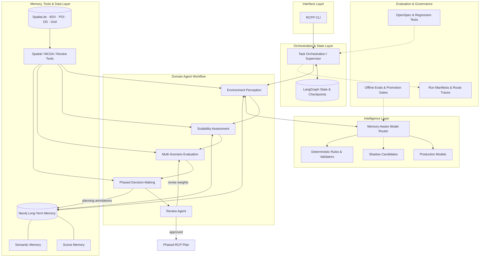

# RCPP-Agent

## Overview
RCPP-Agent is a LLM-based multi-agent architecture for fine-grained roadside charging pile planning. This architecture integrates six specialized agents to operationalize an expert-inspired planning workflow, from multimodal environmental perception and suitability assessment to multi-scenario evaluation and phased decision-making.




## Prerequisites

- Python **3.10+**
- SpatiaLite
- Neo4j Database
- Fine-tuned LLM and MLLM
- Optional LLM API key for natural-language parsing or LLM-AHP

## Installation

Clone the repository to your local machine:

```bash
git clone https://github.com/NNUSCENSLAB/RCPP-Agent.git
cd RCPP-Agent
```

Install the required packages (Python 3.9+):

```bash
pip install -r requirements.txt
pip install -e . --no-deps
```

## Configuration

- Create **`configs/.env`** for secrets and overrides.
- **`configs/config.py`** defines global multi-agent settings.
- **`configs/data_config.py`** defines workspace paths, Neo4j env names, and SpatiaLite defaults.

## CLI usage

`rcpp` is the only supported executable entrypoint. Start with a readiness check:

```bash
rcpp doctor
```

Import study-area data and run a structured plan without a cloud language-model API:

```bash
rcpp data import --area <district_slug>
rcpp plan run --area <district_slug> --scenario balance_oriented \
  --start-year 2025 --end-year 2030 --weight-source cached
```

Inspect or resume a run:

```bash
rcpp plan status <run-id>
rcpp plan resume <run-id>
rcpp router explain <run-id>
rcpp router stats
```

`--instruction "..."` is an optional CLI path that invokes the configured
`general_reasoning` provider. Structured arguments are preferred for reproducibility.
The former standalone Python script entrypoint has been removed; use `rcpp` for all
runtime operations.

## Memory-Aware Dynamic Routing

The production memory extractors remain the evaluated Qwen2.5 LoRA deployments. Qwen3
candidates are registered as Shadow deployments and are disabled when their model or
adapter path is unavailable. Shadow output is written separately as `*.shadow.json`
and is never merged into production memory.

The policy-driven router evaluates task modality, memory lifecycle, memory quality,
risk, and candidate readiness at runtime. It can reuse fresh memory, infer only missing
fields, refresh stale or conflicted records, or escalate failed Scene tasks for human
review. A fresh memory with quality at least 0.9 can bypass model inference, and Scene
failures never fall through to a text-only model.

The `general_reasoning` model is an optional Provider-neutral dependency. Configure the
selected Provider, model identifier, and corresponding API key in `configs/.env`:

```dotenv
RCPP_GENERAL_PROVIDER=<provider>
RCPP_GENERAL_MODEL=<model-id>
<PROVIDER>_API_KEY=<api-key>
```

API keys are isolated by Provider and are only supplied to the selected LLM service.

## Versioned Scene and Semantic Memory

The perception layer keeps two independently versioned memories per RPS:

- `SceneMemory`: red-boxed stall occupancy, obstacles, clearance, visual evidence, and model metadata.
- `SemanticMemory`: deterministic urban-context labels plus an evidence-grounded language summary.

Neo4j retains the legacy `GlobalSceneSemanticMemory` aggregate for LangGraph compatibility and also writes normalized `RPS`, `SceneMemory`, and `SemanticMemory` nodes. Each version stores the base model, adapter version, schema version, generation time, quality score, evidence source, lifecycle status, and optional expiry. New versions retain `SUPERSEDES` links to prior versions.

Model selection is centralized in `rcpp_core/model_registry.py`. The currently validated
models remain production defaults; unvalidated candidates stay disabled or run only in
Shadow mode. A text-only model is never used as a visual fallback, and invalid Scene
outputs are marked for human review.
Semantic failures always retain a deterministic safe summary. To let the optional
general Provider rewrite only explanatory strings, set
`RCPP_SEMANTIC_REPAIR_WITH_GENERAL=true`; repaired output is accepted only after the
same rule-consistency checks.

## OpenSpec

The behavior-level change specifications live under `openspec/changes/`:

- `cli-only-runtime`
- `memory-lifecycle-and-retrieval`
- `memory-aware-cascade-router`

Each proposal contains design constraints, testable requirements, and task status.
Planned work is left unchecked so documentation does not present it as implemented.

## Project Structure

```
RCPP-Agent/
├── configs/
│   ├── config.py               # Multi-agent configurations
│   └── data_config.py          # Data configurations
├── rcpp_core/
│   ├── prompts.py              # Prompt templates for agents
│   ├── model_registry.py       # Versioned model pool and selection policy
│   ├── semantic_rules.py       # Deterministic semantic labels and evidence
│   ├── memory_schema.py        # Validation and memory metadata
│   ├── memory_lifecycle.py     # Active, expired, conflicted, and superseded states
│   ├── routing.py              # Memory-aware model routing policy
│   ├── runtime.py              # LangGraph workflow runtime used by the CLI
│   ├── scene_semantic_inference.py   # Multimodal inference glue
│   ├── build_scene_semantic_memory.py  # Neo4j load, merge, save helpers
│   └── neo4j_scene_semantic_store.py   # LangGraph store on Neo4j
├── src/
│   ├── task_orchestration_agent.py   # Top orchestrator
│   ├── environment_perception_agent.py   # scene-semantic memory construction
│   ├── suitability_assessment_agent.py   # RCP suitability scoring
│   ├── multi_scenario_evaluation_agent.py   # Scenario weights via LLM-AHP
│   ├── phased_decision_making_agent.py   # Phased strategy and candidate scores
│   └── review_agent.py         # Plan review and readjust signal
├── tools/
│   ├── base.py / registry.py   # Tool base class and registration
│   ├── llm_ahp_tool.py         # LLM-AHP subgraph
│   ├── rcpp_paths.py           # Workspace path helpers
│   ├── data_flow_tool/         # SpatiaLite ingest
│   ├── memory_construction_tool/   # Perception pipeline tools
│   ├── multi_scenario_evaluation_tool/   # MCDA calculators
│   └── review_tool/            # Review metrics tools
├── training/                    # Reserved model experiment utilities
├── evaluation/                  # Model evaluation and promotion utilities
├── rcpp_cli/                    # Public CLI entrypoint and subcommands
├── openspec/                    # Behavior specs and implementation checklists
└── tests/                       # Rule, schema, routing, split, compatibility tests
```

## Changelog

### 2026-04-22 v1.0

1. Created the RCPP-Agent.
