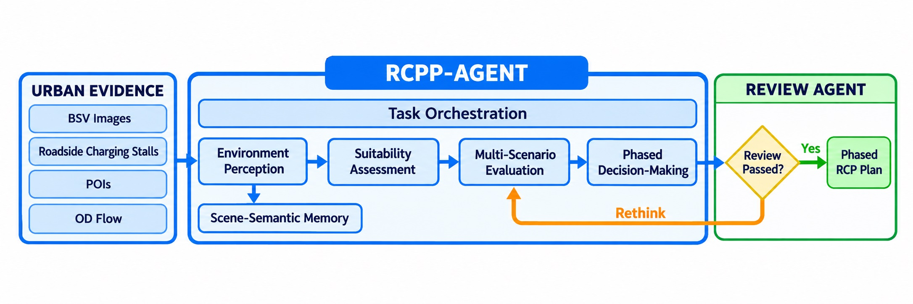

<div align="center">

<h1 align="center">RCPP-Agent: Roadside Charging Piles Planning Agent</h1>

<p><strong>Explainable Planning for Roadside EV Charging Infrastructure</strong></p>

<p>Street-view imagery · Urban spatial data · Multi-stage planning</p>

<p>
  <a href="https://www.python.org/"></a>
  <a href="https://github.com/langchain-ai/langgraph"></a>
  <a href="pyproject.toml"></a>
</p>

[What is RCPP-Agent?](#what-is-rcpp-agent) · [Quick Start](#quick-start) · [Architecture](#architecture) · [Why RCPP-Agent?](#why-rcpp-agent)

</div>

---

## What is RCPP-Agent?

**RCPP-Agent is a multi-agent system for planning roadside EV charging infrastructure using street-view imagery and urban spatial data.**

The workflow uses LangGraph to coordinate perception, suitability assessment, scenario evaluation, phased planning, and outcome review. Each stage records its evidence and intermediate state. This makes interrupted runs resumable and the resulting plans easier to inspect.

### Where to start

| Task | Command | Requirements |
| --- | --- | --- |
| Understand the routing policy | `rcpp router explain --kind scene --memory-state fresh --memory-quality 0.95` | Installed package only |
| Inspect existing memory | `rcpp memory inspect <path>` | Scene-semantic memory JSON |
| Run a reproducible district plan | `rcpp data import` → `rcpp plan run` | Study-area data, SpatiaLite, Neo4j, local models |
| Use natural-language instructions | `rcpp plan run --instruction "..."` | Configured reasoning provider |

> [!NOTE]
> Full district runs require local data and model assets. Cloud LLM features are optional.

## Quick Start

### 1. Install

```bash
git clone https://github.com/NNUSCENSLAB/RCPP-Agent.git
cd RCPP-Agent

python -m venv .venv
# Linux/macOS: source .venv/bin/activate
# Windows: .venv\Scripts\activate

python -m pip install --upgrade pip
python -m pip install -r requirements.txt
python -m pip install -e . --no-deps
```

RCPP-Agent requires **Python 3.10+**.

### 2. Check your environment

```bash
rcpp doctor
```

This reports workspace, model, provider, and credential readiness without launching a planning run.

### 3. Try the routing policy

This command requires no study-area dataset and demonstrates how validated memory can bypass inference:

```bash
rcpp router explain \
  --kind scene \
  --memory-state fresh \
  --memory-quality 0.95
```

The routing result includes this action:

```json
{
  "action": "reuse_memory"
}
```

### 4. Run a study area

Prepare the following input layout:

```text
<study-area>/
├── BSV/                  # street-view images
├── OD/
│   ├── regions.shp
│   └── od_flows.shp
├── POI/                  # CSV files with name, lng, lat
├── RPS/                  # candidate roadside parking-space shapefiles
└── roads/                # road-network shapefiles
```

Configure the data location and launch a reproducible run:

```bash
# Linux/macOS
export RCPPAGENT_RAW_DATA_BASE=/absolute/path/to/study-area
export RCPPAGENT_WORKSPACE=/absolute/path/to/RCPP-Agent

# PowerShell
# $env:RCPPAGENT_RAW_DATA_BASE = "C:\path\to\study-area"
# $env:RCPPAGENT_WORKSPACE = "C:\path\to\RCPP-Agent"

rcpp data import --area <district_slug>

rcpp plan run \
  --area <district_slug> \
  --scenario balance_oriented \
  --start-year 2025 \
  --end-year 2030 \
  --weight-source cached
```

Structured arguments with `cached` weights are the default reproducible path and do not require a cloud LLM API.

## Architecture

<p align="center">
  
</p>

Multimodal evidence passes through five planning stages. Review results can trigger another scenario-weighting iteration.

The workflow consists of five stages:

1. **Environment Perception** creates structured scene and semantic memory from visual and spatial evidence.
2. **Suitability Assessment** checks candidate sites against physical, environmental, grid, traffic, and regulatory constraints.
3. **Multi-Scenario Evaluation** calculates scenario-specific weights with MCDA and AHP.
4. **Phased Decision-Making** turns candidate scores into a multi-year deployment plan.
5. **Outcome Review** evaluates the plan and either accepts it or requests another weighting iteration.

SQLite stores workflow checkpoints for resuming interrupted runs. Neo4j stores long-term planning memory. Run manifests and route traces record model and policy decisions.

## Why RCPP-Agent?

| Concern | RCPP-Agent approach |
| --- | --- |
| Planning output | Scenario-specific, multi-year deployment plans |
| Repeated inference | Versioned memory is reused while its evidence remains valid |
| Traceability | Routing decisions and run manifests are recorded |
| Review | Review metrics can trigger another weighting iteration |
| Modality safety | Failed scene inference is not passed to a text-only fallback |

## Core Components

### 🧠 Long-term memory

Every roadside parking space can hold two independently versioned memories:

- **SceneMemory:** occupancy, obstacles, clearance, visual evidence, and model metadata.
- **SemanticMemory:** deterministic urban-context labels and an evidence-grounded summary.

Memory that passes freshness and quality checks can be reused without another model call. Partial or stale records are refreshed. Conflicted scene records are flagged instead of being passed to a text-only model.

### 🔀 Model routing

The router evaluates task modality, memory lifecycle, quality, request risk, and model readiness. It can:

- reuse validated memory
- infer only missing fields
- refresh stale or conflicted records
- request human review for unsafe scene failures

Every decision is written to `route.json`.

### 📍 Scenario planning

RCPP-Agent supports three explicit planning perspectives:

| Scenario | Planning emphasis |
| --- | --- |
| `efficiency_oriented` | Prioritize high-value sites and deployment efficiency. |
| `equity_oriented` | Prioritize coverage and spatial accessibility. |
| `balance_oriented` | Balance technical, economic, social, traffic, and policy objectives. |

Each plan is divided into initiation, scale-up, and refinement phases.

## Configuration

Create `configs/.env` for secrets and machine-specific paths. Do not commit this file.

```dotenv
# Workspace and study-area data
RCPPAGENT_WORKSPACE=/absolute/path/to/RCPP-Agent
RCPPAGENT_RAW_DATA_BASE=/absolute/path/to/study-area

# Neo4j long-term memory
NEO4J_URI=bolt://localhost:7687
NEO4J_USER=neo4j
NEO4J_PASSWORD=change-me
NEO4J_DATABASE=neo4j

# Optional general-reasoning provider
RCPP_GENERAL_PROVIDER=<provider>
RCPP_GENERAL_MODEL=<model-id>
<PROVIDER>_API_KEY=<api-key>
```

Provider keys are passed only to the selected service. Natural-language instructions and LLM-generated AHP weights require a configured provider. Structured planning arguments do not.

- Model registry: [`rcpp_core/model_registry.py`](rcpp_core/model_registry.py)
- Data and workspace paths: [`configs/data_config.py`](configs/data_config.py)
- Runtime graph: [`rcpp_core/runtime.py`](rcpp_core/runtime.py)

## Outputs & Reproducibility

Each run is stored under `.rcpp/runs/<run-id>/`:

```text
<run-id>/
├── manifest.json         # input, status, timestamps, and final result
├── route.json            # memory state and routing decisions
└── result.json           # completed planning output
```

Planning stages also export geospatial and evaluation artifacts under `output/`. Neo4j retains normalized `RPS`, `SceneMemory`, and `SemanticMemory` nodes with model, adapter, schema, quality, evidence, lifecycle, and supersession metadata.

## Project Structure

```text
RCPP-Agent/
├── configs/              # runtime, provider, data, and path configuration
├── rcpp_cli/             # public rcpp command-line interface
├── rcpp_core/            # runtime, routing, memory, schemas, and model registry
├── src/                  # supervisor and specialized planning agents
├── tools/                # spatial ingest, MCDA, memory, and review tools
├── evaluation/           # offline metrics and model evaluation
├── training/             # dataset preparation and experiment utilities
├── openspec/             # behavior specifications and checklists
├── docs/assets/          # README architecture and visual assets
└── tests/                # CLI, routing, memory, evaluation, and compatibility tests
```


## Citation

Publication details and a machine-readable `CITATION.cff` will be added when they are available.

## Contributing

Issues and pull requests are welcome. For substantial changes, describe the affected planning assumption, data contract, or behavior before implementation.
